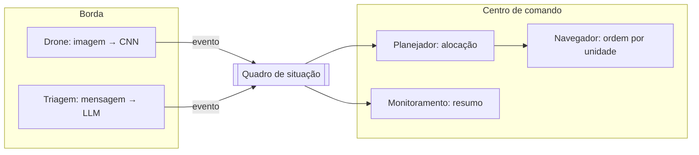

# Agente de Monitoramento de Enchentes

Detecção de enchentes em imagens com uma CNN e agentes que recebem os eventos e geram
alertas, plano de recursos e ordens de resgate.

- Parte 1, `model_train.ipynb`: treina e avalia um classificador de enchente com
  MobileNetV2 (transfer learning) e compara com o Xception.
- Parte 2, pasta `agent/` e `app.py`: agentes de monitoramento com CrewAI e um servidor
  LLM. A CNN detecta na borda e os agentes transformam os eventos em um boletim para a
  Defesa Civil.

Dataset: [Louisiana Flood 2016](https://www.kaggle.com/datasets/rahultp97/louisiana-flood-2016).

## Instalação

```bash
pip install -r requirements.txt
```

A Parte 2 precisa de um servidor LLM. O padrão é o [Ollama](https://ollama.com) local com
um modelo de texto, mas qualquer provedor do LiteLLM serve. Dá para configurar provedor,
modelo, servidor e chave em `agent/settings.py`, por variável de ambiente, ou na aba
Configurações do app.

## Parte 1: treinar e avaliar a CNN

```bash
jupyter nbconvert --to notebook --execute --inplace model_train.ipynb
```

O notebook baixa o dataset, monta o pipeline de imagens em 224x224, constrói o MobileNetV2
com a base congelada e uma cabeça binária, treina, avalia e salva o modelo em
`flood_mobilenetv2.keras`. O arquivo já leva a augmentation e a normalização embutidas, então
na inferência basta passar a imagem redimensionada. Treino só a cabeça, porque com 270
imagens ajustar a base inteira levaria a overfitting.

Resultados no conjunto de teste, mesmo dataset de 270 treino e 52 teste:

| Métrica | MobileNetV2 (este trabalho) | Xception |
|---|:--:|:--:|
| Acurácia | 0,85 | ~0,94 |
| Parâmetros | 2,26 M | ~22 M |
| Tempo de treino | ~120 s em 60 épocas | épocas de ~70 a 100 s |
| Latência por imagem | ~40 ms | bem maior |
| F1 da classe enchente | ~0,78 | não medido |

Os números do Xception são os do notebook de aula, não retreinei aqui. A comparação não é
perfeitamente controlada, mas o recado fica claro: o MobileNetV2 troca um pouco de acurácia
por ser cerca de 10 vezes mais leve e mais rápido, que é o perfil certo para rodar num drone.
Como o teste tem só 52 imagens, um ou dois pontos de acurácia são ruído.

## Parte 2: agentes de monitoramento

```bash
python app.py
```

As imagens de exemplo das estações já vêm no repositório. Para gerar de novo a partir do
dataset, rode `python -m agent.setup_stations`.

A interface tem cinco abas:

- Sensor / Drone: sobe uma imagem, a CNN detecta enchente e publica o evento. Sem LLM aqui.
- Triagem: cola uma mensagem de vítima e o agente extrai um pedido estruturado, descartando
  o que não é emergência.
- Centro de Comando: junta os eventos, define a frota, o Planejador decide a alocação e o
  Monitoramento escreve o resumo.
- Equipes ativas: cada unidade despachada aparece aqui e o Navegador gera a ordem da missão.
- Configurações: escolhe provedor, servidor, modelo e chave de API.

Sem servidor LLM, o Planejador, o Monitoramento e o Navegador caem para versões por regras e
a demo continua rodando. Só a Triagem fica indisponível, porque depende de ler texto livre.

### Arquitetura



Na ponta só faz sentido a CNN leve, porque a banda e a conexão do drone são limitadas. O LLM
é caro e lento por frame, então fica no centro de comando, chamado por evento. A alocação de
recursos é determinística e respeita o estoque. O LLM só narra e justifica a decisão, nunca
decide sozinho.

### Os agentes

| Agente | Tipo | Papel | Status |
|---|---|---|---|
| Monitoramento | Reativo | Detecta enchente com a CNN e escreve o resumo da situação | Pronto |
| Triagem | Reativo | Extrai de uma mensagem crua um pedido estruturado | Pronto |
| Planejador | Deliberativo | Justifica a alocação de recursos sobre as demandas | Pronto |
| Navegador | Deliberativo | Escreve a ordem da missão, ainda sem motor de rotas | Mock |

### Testes dos agentes

`test_agente.ipynb` roda os quatro agentes de ponta a ponta: triagem, detecção da CNN, plano,
resumo e ordem tática. Defina provedor, modelo e servidor no topo do notebook e execute:

```bash
jupyter nbconvert --to notebook --execute --inplace test_agente.ipynb
```

Na execução registrada, os quatro agentes rodaram juntos sem erro. A triagem leu cinco
mensagens desorganizadas, estruturou os pedidos e descartou o que não era emergência. A CNN
achou três enchentes nas imagens da estação. O quadro juntou tudo em cinco demandas
priorizadas, o planejador distribuiu a frota e apontou onde faltou recurso, e o navegador
escreveu a ordem de cada equipe.

Tempo por resposta numa RTX 3070 de 8 GB. Usei o Qwen3.5 9B, que tem raciocínio, e o Qwen3
4B, que não tem. No Ollama eles estão como `text-qwen35-9b` e `text-qwen3-4b`:

| Agente | 9B | 4B |
|---|:--:|:--:|
| Triagem | ~54 s | ~2 s |
| Planejador | ~131 s | ~2 s |
| Monitoramento | ~115 s | ~2 s |
| Navegador | ~86 s | ~0,3 s |

A triagem é a média de 5 mensagens. O ~0,3 s do navegador no 4B é porque a resposta veio
incompleta e caiu no plano por regras.

Cada chamada levou de um a dois minutos, muito acima dos ~40 ms da CNN por imagem. No começo
achei que fosse a VRAM, mas o `ollama show` mostrou o motivo real. O 9B é um modelo de
raciocínio, ele gera um bloco de pensamento antes de responder, e isso gasta tempo. Mesmo com
a VRAM livre não ficou mais rápido. Por isso também subi o tempo limite por chamada para
300 s, senão o resumo do monitoramento estourava.

Em troca da velocidade, o 4B perde qualidade. Ele rebaixou urgências na triagem, embaralhou a
ordem de prioridade no plano e deu uma resposta incompleta no navegador, que caiu no plano por
regras. É a mesma troca da CNN, o modelo leve é rápido e o pesado é mais confiável. Fiquei com
o 9B para este protótipo.